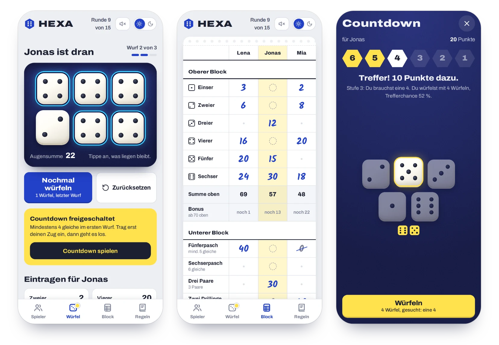
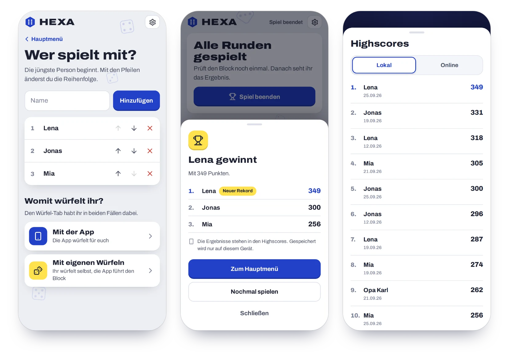
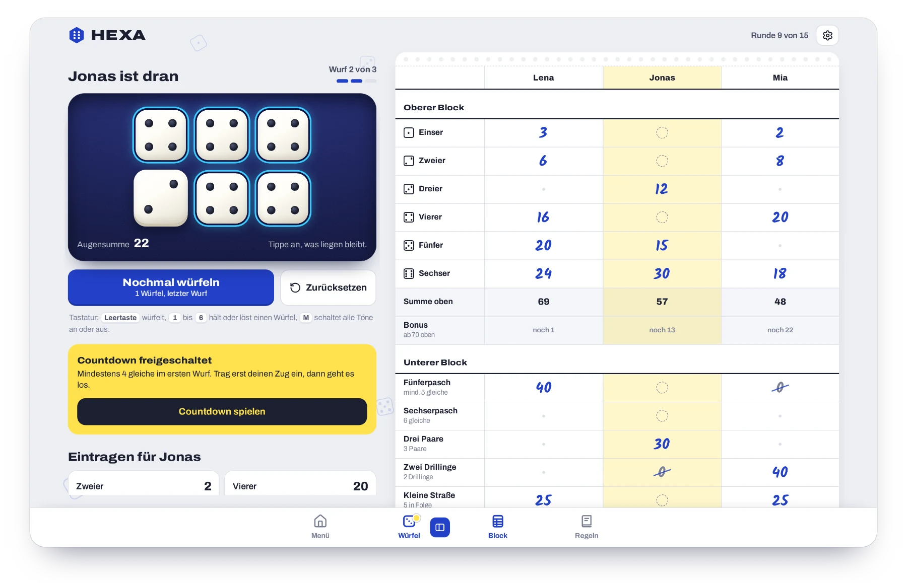

<div align="center">


# HEXA

**Sechs Würfel. Drei Würfe. Ein Countdown.**

Das Würfelspiel für eine oder mehr Personen, auch gegen Bots – Würfel, Spielblock und Regeln in einer App.<br>
Läuft direkt im Browser, auf dem Handy wie am Laptop. Ohne Installation, ohne Konto, ohne Abhängigkeiten.

### [▶&nbsp;Jetzt spielen](https://unpacked-dev.github.io/hexa/)

[](https://github.com/unpacked-dev/hexa/releases/latest)
[](https://github.com/unpacked-dev/hexa/actions/workflows/ci.yml)
[](#technik)
[](#technik)
[](LICENSE)

<br>

<picture>
  <source media="(prefers-color-scheme: dark)" srcset="docs/screenshots/hero-dark.webp">
  
</picture>

</div>

## Worum geht’s?

Bei HEXA würfelst du um die besten Kombinationen: Pasche, Straßen, Paare und Drillinge – oder einfach um möglichst viele Augen. In 15 Runden füllst du deinen Spielblock Feld für Feld, und jedes Feld darfst du nur einmal belegen.

Wer geschickt plant, holt sich im oberen Block einen dicken Bonus. Und wer schon im ersten Wurf vier gleiche Zahlen hat, darf zusätzlich den **Countdown** spielen: von 6 bis 1 herunterzählen, 10 Punkte pro geschaffter Stufe.

Die App ersetzt Würfel, Becher, Block und Stift. Ihr gebt einfach das Handy reihum – oder legt es in die Mitte.

## So läuft ein Spiel

1. Im Hauptmenü **Lokal** wählen und eintragen, wer mitspielt. Mit **Bot hinzufügen** kommen Computergegner dazu.
2. Entscheiden, **womit ihr würfelt**: mit der App oder mit euren eigenen Würfeln. Den Spielblock führt die App in beiden Fällen. Mit Bots würfelt immer die App.
3. Reihum spielen. Über **Menü** könnt ihr jederzeit pausieren und später weitermachen.
4. Nach 15 Runden auf **Spiel beenden** tippen. Das Ergebnis zeigt die Platzierung, die Punkte landen in den **Highscores**.

<div align="center">
<picture>
  <source media="(prefers-color-scheme: dark)" srcset="docs/screenshots/flow-dark.webp">
  
</picture>
</div>

## Features

- **Hauptmenü** – lokal auf einem Gerät reihum spielen, Highscores ansehen, Einstellungen öffnen. Online kommt bald.
- **Mit App- oder eigenen Würfeln** – vor dem Spiel wählen: Die App würfelt für euch, oder ihr würfelt selbst und nutzt nur den Spielblock.
- **Würfeln mit Gefühl** – sechs Würfel mit Rollanimation, Klackern und Vibration. Tippen hält einen Würfel fest, nochmal Tippen löst ihn wieder.
- **Spielblock, der mitrechnet** – Summen, Bonus und Endstand werden automatisch berechnet. Nach jedem Wurf zeigt die App, wie viele Punkte jedes freie Feld bringen würde.
- **Countdown als Bonusspiel** – wird automatisch freigeschaltet und direkt nach dem Zug gestartet.
- **Mehrere Personen oder solo** – Reihenfolge vor dem Spiel festlegen. Im Spiel lassen sich Namen ändern und Personen entfernen.
- **Bots als Gegner** – Computergegner mit Namen wie Pasch-Paula oder Dr. Wurf. Sie spielen sichtbar Zug für Zug und fast perfekt: im Schnitt 322 Punkte, perfektes Spiel bringt 324. In die Highscores kommen nur Menschen.
- **Spielende und Highscores** – das Ergebnis zeigt alle Platzierungen und neue Rekorde. Die zehn besten Ergebnisse bleiben auf dem Gerät gespeichert, Online-Highscores kommen bald.
- **Nichts geht verloren** – Spiele lassen sich pausieren und bleiben auch nach dem Schließen erhalten. Einträge, entfernte Personen oder ein abgebrochenes Spiel lassen sich mit einem Tipp rückgängig machen.
- **Regeln eingebaut** – Kurzübersicht, Beispiele und Wahrscheinlichkeiten für Neugierige.
- **Einstellungen** – Design hell, dunkel oder automatisch. Musik und Spielsounds lassen sich getrennt an- und ausschalten und leiser stellen.
- **Ton** – Effekte und entspannte Lo-Fi-Musik, live im Browser erzeugt.
- **Fallende Würfel** – langsam fallende Würfel im Hintergrund, in den Einstellungen abschaltbar. Bei „Bewegung reduzieren“ stehen sie still.
- **Nebeneinander** – auf großen Bildschirmen holt ein Knopf im Würfel- oder Block-Tab die andere Ansicht dazu.
- **Auf den Home-Bildschirm** – lässt sich wie eine App installieren und startet dann im Vollbild. Der Bildschirm bleibt während des Spiels an.

<div align="center">
<picture>
  <source media="(prefers-color-scheme: dark)" srcset="docs/screenshots/desktop-dark.webp">
  
</picture>
</div>

## Die Regeln in 30 Sekunden

| | |
| --- | --- |
| **Ziel** | In 15 Runden möglichst viele Punkte sammeln. |
| **Dein Zug** | Bis zu 3 Würfe. Dazwischen beliebig viele Würfel zur Seite legen – oder wieder mitwürfeln. |
| **Eintragen** | Pro Zug genau ein freies Feld. Voraussetzung nicht erfüllt: 0 Punkte. |
| **Bonus** | Oberer Block mindestens 70 Punkte → 40 Bonuspunkte. |
| **Countdown** | Mindestens 4 gleiche im ersten Wurf → nach dem Zug von 6 bis 1 herunterzählen, 10 Punkte pro geschaffter Stufe. |
| **Endstand** | Summe oben + Bonus + Summe unten + Countdown. |

<details>
<summary><b>Alle Felder im Überblick</b></summary>

<br>

**Oberer Block** – nur die Würfel mit der passenden Zahl zählen.

| Feld | Punkte |
| --- | ---: |
| Einser bis Sechser | Summe der passenden Würfel (max. 6 bis 36) |

**Unterer Block** – feste Punkte, wenn die Kombination steht.

| Feld | Voraussetzung | Punkte |
| --- | --- | ---: |
| Fünferpasch | mindestens 5 gleiche | 40 |
| Sechserpasch | 6 gleiche | 75 |
| Drei Paare | 3 Paare (ein Vierling zählt als zwei) | 30 |
| Zwei Drillinge | 2 Drillinge | 40 |
| Kleine Straße | 1-2-3-4-5 oder 2-3-4-5-6 | 25 |
| Große Straße | 1-2-3-4-5-6 | 40 |
| Tiefflug | jeder Würfel zeigt 1, 2 oder 3 | 25 |
| Höhenflug | jeder Würfel zeigt 4, 5 oder 6 | 25 |
| Chance | keine | Augensumme |

Die vollständigen Regeln mit Beispielen stehen in der App im Bereich **Regeln**.

</details>

## Loslegen

**Online:** [unpacked-dev.github.io/hexa](https://unpacked-dev.github.io/hexa/) öffnen und losspielen.

**Lokal:** Repository klonen und `index.html` im Browser öffnen – fertig. Es gibt keinen Build-Schritt.

```bash
git clone https://github.com/unpacked-dev/hexa.git
cd hexa
open index.html            # macOS  ·  Windows: start index.html  ·  Linux: xdg-open index.html
```

Wer lieber über einen lokalen Server testet (z. B. für das Web-App-Manifest):

```bash
python3 -m http.server 8000   # dann http://localhost:8000 öffnen
```

**Als App aufs Handy:** Seite im Browser öffnen und *Zum Home-Bildschirm hinzufügen* wählen.

### Tastatur

| Taste | Aktion |
| --- | --- |
| <kbd>Leertaste</kbd> | würfeln (auch im Countdown) |
| <kbd>1</kbd> – <kbd>6</kbd> | Würfel halten oder lösen |
| <kbd>M</kbd> | alle Töne an oder aus |
| <kbd>Esc</kbd> | Fenster schließen |

## Technik

HEXA ist bewusst einfach gebaut: **reines HTML, CSS und JavaScript** – kein Framework, kein Bundler, keine Pakete.

- **Ton aus dem Browser:** Alle Effekte und die Lo-Fi-Musik entstehen live mit der Web Audio API. Es wird keine einzige Audiodatei geladen.
- **Faire Würfel:** Zufallszahlen kommen aus `crypto.getRandomValues`, ohne Modulo-Verzerrung.
- **Bots mit Mathe statt KI:** Ein Bot rechnet jeden Zug exakt durch. Für jede Möglichkeit, Würfel liegen zu lassen, kennt er die Wahrscheinlichkeit jedes Ergebnisses. Was ein Feld für den Rest des Spiels wert ist, schätzt er mit rund 170 Zahlen. Die stammen aus dem perfekten Spiel, das die Werkzeuge in `tools/` für alle 1,65 Millionen Spielstände ausrechnen.
- **Alles bleibt auf dem Gerät:** Spielstand, Highscores, Design und Ton werden im `localStorage` deines Browsers gespeichert und nie übertragen. Es gibt kein Konto und kein Backend.
- **Keine fremden Server:** Schriften und Icons liegen im Repository. Beim Spielen wird nichts von Google oder anderen Anbietern geladen. Es gibt keine Cookies und kein Tracking.
- **Barrierearm:** Bedienbar per Tastatur, mit Screenreader-Beschriftungen, sichtbarem Fokus und Rücksicht auf *reduzierte Bewegung*.
- **Moderne Web-APIs, wo verfügbar:** Screen Wake Lock (Bildschirm bleibt an), View Transitions (weicher Wechsel hell/dunkel), Vibration.
- **Schriften:** [Archivo](https://github.com/Omnibus-Type/Archivo) und [Kalam](https://fonts.google.com/specimen/Kalam), lokal eingebunden (SIL Open Font License).

### Projektstruktur

```
hexa/
├── index.html             # Aufbau der Seite
├── css/
│   └── hexa.css           # Design, hell und dunkel
├── js/
│   ├── theme-init.js      # setzt das gewählte Design vor dem ersten Zeichnen
│   ├── rules.js           # Felder, Punkte und Wertung
│   ├── bot.js             # Computergegner: welche Würfel liegen bleiben, welches Feld
│   ├── sound.js           # Effekte und Lo-Fi-Musik (Web Audio)
│   ├── i18n.js            # wählt die Sprache und liefert die Texte
│   └── app.js             # Spielablauf, Darstellung, Eingaben
├── lang/
│   ├── de.js              # alle Texte auf Deutsch (Hauptsprache), auch die Regeln
│   └── en.js              # alle Texte auf Englisch
├── fonts/                 # Schriften Archivo und Kalam mit Lizenztexten
├── icons/                 # App-Icons für Home-Bildschirm
├── manifest.webmanifest   # macht HEXA installierbar
├── tests/
│   ├── rules.test.js      # Tests für die Wertung
│   ├── lang.test.js       # prüft, dass beide Sprachen vollständig sind
│   └── bot.test.js        # Tests für die Bots
├── tools/
│   ├── bot-optimal.js     # rechnet das perfekte Spiel für alle Spielstände aus
│   ├── bot-fit.js         # leitet daraus die Werte für die Bots ab
│   └── bot-sim.js         # lässt Bots viele Partien spielen und zeigt die Zahlen
├── docs/                  # Screenshots, Vorschaubild und Konzept für den Online-Modus
└── THIRD-PARTY-NOTICES.md # Lizenzen von Schriften und Icons
```

### Tests

Wertung, Sprachen und Bots sind mit dem eingebauten Test-Runner von Node.js abgedeckt (Node 18 oder neuer, keine Installation nötig):

```bash
node --test
```

Wer die Bots selbst nachrechnen möchte:

```bash
node tools/bot-optimal.js                  # perfektes Spiel ausrechnen (rund 30 s, legt 9 MB in tools/out/ ab)
node tools/bot-sim.js 100000 bot,perfekt   # 100.000 Partien simulieren und vergleichen
```

## Lizenz

[MIT](LICENSE) – mach damit, was du möchtest.

Die Schriften (SIL Open Font License) und einige Icons (Lucide, ISC/MIT) stammen von anderen und stehen unter eigenen freien Lizenzen. Details stehen in [THIRD-PARTY-NOTICES.md](THIRD-PARTY-NOTICES.md).
