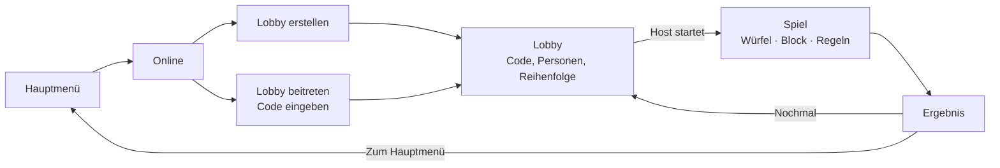
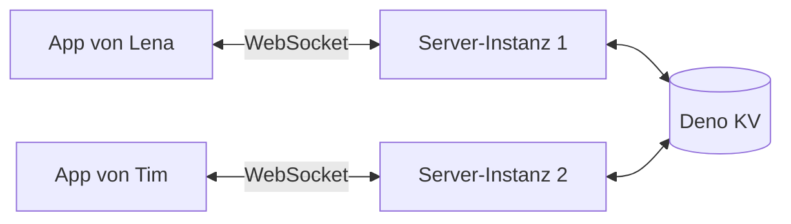
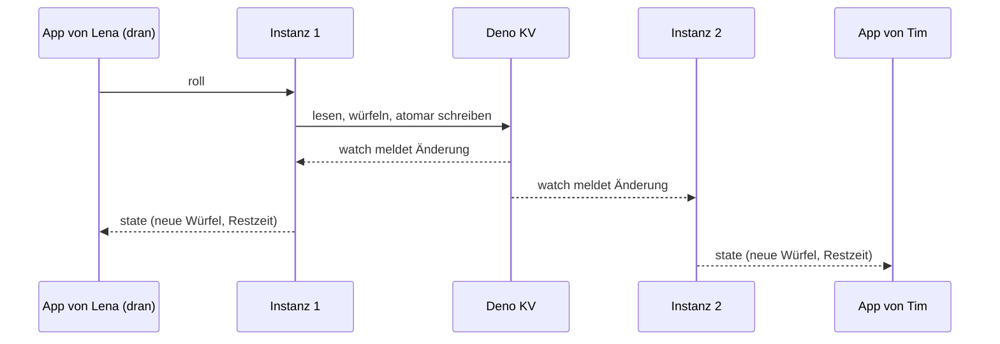

# Online-Modus – Konzept

> **Konzept, alle Fragen geklärt.** Noch ist nichts davon gebaut. Stand: 25. September 2026.

## Kurz gesagt

Mehrere Leute spielen HEXA zusammen, jede Person am eigenen Gerät. Eine Person erstellt eine Lobby und bekommt einen Code aus 4 Buchstaben. Die anderen treten mit diesem Code bei. Man kann auch allein online spielen. Es gibt keine Konten, nur Spitznamen.

Der Server würfelt, prüft jeden Zug und achtet auf die Zugzeit von 60 Sekunden. Er läuft mit Deno auf Deno Deploy und speichert alles in Deno KV.

## Schon entschieden

- Der Server kommt ins selbe Repo, in den Ordner `server/`. Er ist open source wie der Rest.
- Keine Konten, nur Spitznamen. Die bestehen nur aus Buchstaben, Zahlen und ein paar Sonderzeichen, ohne Emojis.
- Beitritt nur per Code, ohne Einladungslink. Später soll es auch eine Handy-App geben.
- Der Code hat 4 Buchstaben. Beim Erstellen prüft der Server, ob er noch frei ist.
- „Online“ im Hauptmenü führt zu: Lobby erstellen oder Lobby beitreten.
- Online wird nur mit App-Würfeln gespielt.
- Man kann auch allein online spielen.
- Keine feste Grenze, wie viele mitspielen.
- Der Host legt die Reihenfolge fest, wie im Spieler-Tab des lokalen Spiels.
- Jeder Zug hat 60 Sekunden. Man sieht immer, wer dran ist.
- Kurz vor Schluss blinkt die Zeit, ab 10 Sekunden tickt es.
- Ist die Zeit um, streicht der Server ein zufälliges freies Feld.
- Ein freigeschalteter Countdown hat eigene 30 Sekunden, auch nach einem gestrichenen Zug. Wer darin nicht würfelt, bekommt 0 Punkte. Läuft die Zeit mittendrin ab, zählen die Punkte bis dahin.
- Nach dem Spiel gibt es eine Revanche in derselben Lobby.
- Eine Online-Bestenliste gibt es vorerst nicht. Ob sie kommt, entscheiden wir später.
- Server mit Deno, Datenbank Deno KV.

## Grundsätze (Vorschlag)

1. **Der Server entscheidet.** Er würfelt, prüft jeden Eintrag mit `js/rules.js` und führt den Spielstand. Die App zeigt an und schickt nur Wünsche wie „würfeln“, „Würfel 3 halten“ oder „Große Straße eintragen“. So kann niemand schummeln, obwohl der ganze Code offen ist.
2. **Immer der ganze Stand.** Nach jeder Änderung schickt der Server den kompletten Spielstand, nicht nur die Änderung. Das sind nur ein paar KB. Wer kurz weg war, ist nach dem Wiederverbinden sofort auf dem neuesten Stand.
3. **Gleiche Form wie lokal.** Der Online-Stand hat dieselben Teile wie der lokale (`players`, `scores`, `cds`, `dice`, `cdGame`). So können Block, Würfel, Countdown und Ergebnis fast unverändert bleiben.
4. **Lokal bleibt lokal.** Erst wenn jemand auf „Online“ tippt, verbindet sich die App mit dem Server. Der lokale Modus und die ZIP-Version laufen weiter ohne Internet.
5. **So wenig Daten wie möglich.** Gespeichert werden der Spitzname, ein zufälliger Geräteschlüssel und der Spielstand. Dauerhaft bleibt nichts: Lobbys und Spiele löschen sich von selbst.

## Begriffe

| Begriff | Bedeutung |
|---|---|
| **Lobby** | Der Raum, in dem man sich vor dem Spiel sammelt. |
| **Code** | 4 Buchstaben, z. B. `KXMP`. Damit treten die anderen bei. |
| **Host** | Wer die Lobby erstellt hat. Legt die Reihenfolge fest und startet das Spiel. |
| **Zugzeit** | 60 Sekunden pro Zug. Bewusst nicht „Countdown“, denn so heißt in HEXA schon das Bonusspiel. |

## So läuft es ab



1. **Hauptmenü → Online.** Einmal einen Spitznamen eingeben, die App merkt ihn sich. Dann wählen: Lobby erstellen oder beitreten.
2. **Lobby erstellen.** Der Server vergibt einen freien Code. Den sagt man den anderen, zum Beispiel am Tisch oder im Videocall.
3. **Lobby beitreten.** Code eintippen, fertig. Die Eingabe wird automatisch großgeschrieben.
4. **In der Lobby** sehen alle live, wer schon da ist. Der Host ändert die Reihenfolge mit Pfeilen, wie im Spieler-Tab des lokalen Spiels. Mit einem Tipp auf einen Namen kann der Host die Person entfernen. Gestartet wird, wenn alle da sind. Allein geht es sofort los.
5. **Beim Start** schließt sich die Lobby. Danach kann niemand mehr beitreten, wie im lokalen Spiel.
6. **Im Spiel** gibt es die gewohnten Tabs: Würfel, Block, Regeln und Menü. Wer dran ist, würfelt. Alle anderen sehen die Würfel live mit.
7. **Am Ende** kommt das bekannte Ergebnis-Popup mit allen Punkten. Mit „Nochmal“ geht es zurück in dieselbe Lobby, siehe [Revanche](#revanche).

### Entwürfe

**Online-Start**

```
┌────────────────────────────────┐
│ < Hauptmenü                    │
│                                │
│ Dein Spitzname                 │
│ [ Lena                       ] │
│                                │
│ ┌────────────────────────────┐ │
│ │ + Lobby erstellen          │ │
│ │   Du bekommst einen Code   │ │
│ └────────────────────────────┘ │
│ ┌────────────────────────────┐ │
│ │ > Lobby beitreten          │ │
│ │   Code eingeben            │ │
│ └────────────────────────────┘ │
└────────────────────────────────┘
```

**Lobby**, so sieht es der Host:

```
┌────────────────────────────────┐
│ < Lobby verlassen              │
│                                │
│           LOBBY-CODE           │
│            K X M P             │
│   Sag den anderen den Code.    │
│                                │
│ Reihenfolge                    │
│ 1. Lena (du, Host)     [^] [v] │
│ 2. Tim                 [^] [v] │
│ 3. Mia                 [^] [v] │
│                                │
│ 60 Sekunden pro Zug            │
│                                │
│ [       Spiel starten        ] │
└────────────────────────────────┘
```

Alle anderen sehen die Reihenfolge ohne Pfeile und statt des Knopfs: „Warte, bis Lena startet …“ Ist noch niemand beigetreten, heißt der Knopf „Allein starten“.

**Im Spiel mit der Zugleiste oben**

```
┌────────────────────────────────┐
│ HEXA            Runde 3 von 15 │
│ Tim ist dran              0:42 │
│ [================------------] │
├────────────────────────────────┤
│ Tims Würfel, live:             │
│ [2] [3] [3] [5] [5] [6]        │
│                                │
│ Tim würfelt ...                │
└────────────────────────────────┘
```

## Der Code

- **4 Buchstaben, nur Konsonanten**, z. B. `KXMP`. Ohne A, E, I, O, U und Y entstehen kaum echte oder unschöne Wörter. Außerdem klingen E und I auf Deutsch und Englisch nicht verwechselbar. Mit den übrigen 20 Buchstaben gibt es 160.000 Codes.
- **Nie doppelt:** Der Server legt eine Lobby nur an, wenn es den Code noch nicht gibt. Prüfen und Anlegen passieren in einem einzigen Schritt (atomar in Deno KV). Ziehen zwei Leute im selben Moment denselben Code, bekommt ihn nur eine Person. Die andere bekommt automatisch einen neuen. Das habe ich lokal schon ausprobiert.
- **Wieder frei:** Ist eine Lobby gelöscht, kann ihr Code neu vergeben werden.
- **Kein Durchprobieren:** Von derselben Internetverbindung aus gehen nur wenige Beitrittsversuche pro Minute. Beitreten geht ohnehin nur vor dem Start, und der Host kann Fremde entfernen.

## Spitznamen

Online-Namen dürfen nur diese Zeichen enthalten:

| Was | Erlaubt |
|---|---|
| Buchstaben | A bis Z und a bis z, dazu Ä, Ö, Ü, ä, ö, ü und ß |
| Zahlen | 0 bis 9 |
| Sonderzeichen | Leerzeichen, Bindestrich `-`, Unterstrich `_`, Punkt `.`, `!` und `?` |

- **Länge:** 1 bis 20 Zeichen, darunter mindestens ein Buchstabe oder eine Zahl. „...“ allein geht also nicht.
- **Leerzeichen** am Anfang und Ende fallen weg, mehrere hintereinander werden zu einem. So macht es auch das lokale Spiel.
- **Nicht erlaubt** sind Emojis, Akzente wie é oder ñ, andere Schriften und alle übrigen Sonderzeichen. Vor allem die Zeichen `< > & " '`, mit denen man HTML bauen könnte, gehen nie. Selbst wenn irgendwo das Maskieren vergessen würde, könnte ein Name so kein Skript einschleusen.
- **Beim Tippen** lässt die App nur erlaubte Zeichen zu und sagt kurz, was geht. Aus eingefügtem Text entfernt sie den Rest.
- **Der Server prüft trotzdem jeden Namen** und lehnt alles andere ab. Vorher vereinheitlicht er die Schreibweise (Unicode NFC), damit ein ü immer als ü ankommt, egal von welcher Tastatur.
- **Nur online:** Im lokalen Spiel bleibt jeder Name erlaubt. Er verlässt das Gerät ja nie.

| Erlaubt | Abgelehnt |
|---|---|
| `Jürgen`, `Anna-Lena`, `dice_master`, `Dr. Würfel`, `Wer?!` | `Zoë`, `José`, `Lena😀`, `O'Brien`, `<script>`, `...` |

Die Regel steht an einer Stelle, die App und Server beide laden (zum Beispiel in `js/rules.js`), damit sie nie auseinanderläuft:

```js
// Vorher: Schreibweise vereinheitlichen (NFC), Leerzeichen zusammenfassen und außen abschneiden
const NAME_OK = /^(?=.*[A-Za-z0-9ÄÖÜäöüß])[A-Za-z0-9ÄÖÜäöüß _.!?-]{1,20}$/;
```

## Wer ist dran? Die Zugleiste

- Oben im Spiel, in allen Tabs: „Tim ist dran“, die Restzeit und ein Balken, der abläuft.
- **Bist du dran**, steht dort „Du bist dran!“ in der Akzentfarbe. Das Handy vibriert kurz, und es gibt einen Ton, wenn Töne an sind. Die App springt zum Würfel-Tab.
- **Ab 10 Sekunden** werden Zeit und Balken rot und blinken. Wer dran ist, hört jede Sekunde ein leises Ticken. Die anderen sehen nur das Blinken.
- **Würfel-Tab bei den anderen:** Man sieht die Würfel der Person, die dran ist, mit derselben Animation. Die Knöpfe sind gesperrt, dort steht z. B. „Tim würfelt …“.
- **Block-Tab:** Die Spalte der Person, die dran ist, ist hervorgehoben. Deine Spalte trägt ein „Du“. Ein grauer Punkt zeigt, wer gerade keine Verbindung hat.

## Zugzeit

- Jeder Zug hat 60 Sekunden, für alle drei Würfe und das Eintragen. Für die nächste Person startet die Zeit neu. Einstellen muss man nichts.
- Das Ticken ist ein neuer Spielsound. Wie alle Töne entsteht er im Browser und folgt der Einstellung „Spielsounds“.
- Wer im System „Bewegung reduzieren“ eingeschaltet hat, sieht kein Blinken. Die Zeit wird dann nur rot.

**Ist die Zeit um**, streicht der Server ein zufälliges freies Feld. Dort steht dann eine 0, egal was die Würfel zeigen. Alle sehen kurz, was passiert ist, zum Beispiel: „Zeit um – bei Tim wurde die Große Straße gestrichen.“

**Countdown:** Hatte die Person im ersten Wurf 4 gleiche, darf sie den Countdown spielen, auch wenn ihr Zug wegen der Zeit gestrichen wurde. Laut Regeln kommt er nach dem Eintragen, und ein gestrichenes Feld gilt als eingetragen.

- Der Countdown hat eigene 30 Sekunden. Auch hier blinkt und tickt es ab 10 Sekunden.
- Wer bis zum Ende der Zeit gar nicht würfelt, bekommt 0 Punkte.
- Läuft die Zeit mittendrin ab, zählen die Punkte der Stufen, die bis dahin geschafft sind.
- Die Punkte trägt der Server selbst ein, sobald der Countdown vorbei ist. Anders als lokal muss niemand auswählen, wem sie gehören.

**Abwesend:** Wer zwei Züge hintereinander verpasst, gilt als abwesend. Dann streicht der Server bei dieser Person sofort, ohne die 60 Sekunden abzuwarten. So müssen die anderen nicht jedes Mal warten. Sobald die Person wieder verbunden ist, wartet das Spiel wieder auf sie.

### So läuft die Zeit technisch

- Der Server speichert nur den Zeitpunkt, an dem der Zug endet (Deadline). Die Apps rechnen die Restzeit selbst aus. Jede Nachricht vom Server enthält seine Uhrzeit, darum stört eine falsch gehende Handy-Uhr nicht.
- Verzögerte Aufgaben (KV-Queues) gibt es auf dem neuen Deno Deploy nicht. Darum löst das Streichen aus, wer den Ablauf zuerst bemerkt: ein Timer auf dem Server oder eine App im Spiel, die „Zeit um“ meldet. Der Server prüft die Uhrzeit immer selbst.
- Ein atomarer Check in Deno KV sorgt dafür, dass pro Zug genau einmal gestrichen wird, auch wenn es mehrere gleichzeitig versuchen.
- Das Feld lost der Server mit derselben fairen Methode aus wie die Würfel.
- Eine Sekunde Puffer: Ein Tipp in letzter Sekunde zählt auch bei langsamem Netz noch.
- Ist niemand mehr verbunden, bleibt das Spiel einfach stehen.

## Revanche

- Nach dem Spiel geht die Lobby automatisch zurück in den Wartezustand, mit demselben Code, denselben Leuten und derselben Reihenfolge.
- Im Ergebnis-Popup gibt es „Nochmal“ (zurück in die Lobby) und „Zum Hauptmenü“ (Lobby verlassen).
- Der Host kann die Reihenfolge wieder ändern und startet die Revanche. Wer noch das Ergebnis anschaut, ist trotzdem dabei.
- In der Pause können auch neue Leute mit dem Code dazukommen.
- Dein eigenes Ergebnis landet zusätzlich in deinen lokalen Highscores, das der anderen nicht.

## Verbindung weg, App zu, Handy gesperrt

Handys trennen die Verbindung oft, sobald der Bildschirm ausgeht oder man kurz eine andere App öffnet. Das ist der Normalfall, kein Sonderfall.

- Die App verbindet sich automatisch neu und bekommt den kompletten Stand.
- Code und Geräteschlüssel liegen im Gerät. Im Hauptmenü steht dann „Weiterspielen“, wie beim lokalen Spiel.
- Während eines Online-Spiels bleibt der Bildschirm an. Das kann die App schon.

| Was passiert | Was dann |
|---|---|
| Internet kurz weg | Die App verbindet neu, die Zugzeit läuft weiter. |
| Menü → „Zum Hauptmenü“ | Das Spiel läuft ohne dich weiter, bis du zurückkommst. Bei jedem verpassten Zug wird ein zufälliges Feld gestrichen. |
| Menü → „Spiel verlassen“ | Du bist raus, und deine Punkte sind weg. Vorher kommt eine Warnung, wie lokal beim Entfernen. |
| Der Host geht | Die nächste Person wird Host. |
| Alle sind weg | Das Spiel bleibt stehen. Nach 24 Stunden wird es gelöscht. |
| Server-Update | Verbindungen können kurz abreißen, die Apps verbinden neu. |
| Jemand Fremdes tritt bei | Der Host entfernt die Person in der Lobby. |
| Code falsch oder Spiel läuft schon | Eine klare Meldung in der App |
| Name schon vergeben | Der Server hängt eine Zahl an: „Lena 2“. |
| Alte App-Version, z. B. aus einer alten ZIP | Meldung „Bitte HEXA aktualisieren“ |

## Sicherheit

Spitznamen sind fremde Eingaben: Schon in der Lobby siehst du Namen, die jemand auf einem anderen Gerät getippt hat. Darum gilt:

- **Der Server prüft jeden Namen** gegen die feste Zeichenliste aus [Spitznamen](#spitznamen). HTML-Zeichen wie `<` oder `"` sind gar nicht erst erlaubt, unsichtbare Zeichen und Emojis auch nicht.
- **Die App zeigt Namen nie als HTML an,** sondern immer maskiert (`esc()`) oder als reinen Text. So macht sie es schon heute im lokalen Spiel. Tests spielen mit Namen wie ``, um das abzusichern.
- **Nur bekannte Nachrichten:** Der Server nimmt nur die Nachrichten aus der Liste unten an, prüft jedes Feld und verwirft alles andere. Jede Nachricht darf nur wenige KB groß sein.
- **Bremsen:** Lobbys erstellen und beitreten geht nur ein paar Mal pro Minute.
- **Technische Obergrenze:** Eine Grenze fürs Spiel gibt es nicht. Damit aber niemand eine Lobby mit Tausenden Fake-Personen fluten kann, ist bei 50 Schluss. Ein Eintrag in Deno KV darf höchstens 64 KB groß sein. 50 Personen brauchen etwa 15 KB, bei rund 200 wäre die Grenze erreicht.
- **Geräteschlüssel:** Auf dem Server liegt nur ein Hash davon, und an andere Apps geht er nie.
- **Zweites Netz (prüfen):** eine Content Security Policy, die fremde Skripte blockiert. Vorher testen, ob die ZIP-Version damit noch läuft.

## Datenschutz und Recht

Das muss vor dem Start fertig sein:

- **Impressum und Datenschutzerklärung**, erreichbar aus der App und auf der Seite.
- **Nur das Nötigste speichern:** Spitzname, zufälliger Geräteschlüssel (nur als Hash) und Spielstand. Keine E-Mail, kein Konto. IP-Adressen kommen nicht in die Datenbank. Die Bremse gegen zu viele Versuche merkt sie sich nur kurz im Arbeitsspeicher.
- **Automatisch löschen:** Deno KV kann Einträge mit Ablaufzeit speichern. Eine Lobby ohne Start verschwindet nach 1 Stunde, ein Spiel 24 Stunden nach der letzten Aktion. Ohne Bestenliste speichert der Server nichts dauerhaft.
- **Deno als Dienstleister:** Deno ist ein US-Anbieter. Vor dem Start klären: Gibt es einen Vertrag zur Auftragsverarbeitung (AVV)? Wo liegen die Daten? Was protokolliert Deno selbst, zum Beispiel IP-Adressen?

## Technik

### Überblick



- **Eine WebSocket-Verbindung pro Gerät.** Alles läuft darüber: Lobby erstellen, beitreten, würfeln, eintragen. Es gibt keine Cookies und kein Login. Darum klappt es gleich von GitHub Pages, aus der ZIP-Version und später aus der Handy-App.
- **Ein Eintrag pro Lobby in KV** mit dem ganzen Stand. Jede Änderung läuft so: lesen, prüfen, dann atomar schreiben (`atomic().check()`). Kommen zwei Aktionen gleichzeitig, gewinnt eine. Die andere wird neu geprüft. So kann niemand doppelt würfeln.
- **Live über mehrere Instanzen:** Deno Deploy kann die Verbindungen auf mehrere Server-Instanzen verteilen. Lena und Tim hängen dann an verschiedenen. Jede Instanz beobachtet mit `kv.watch()` die Lobbys ihrer Verbindungen und schickt jede Änderung sofort weiter.
- **Würfeln** mit derselben fairen Methode wie in der App (`crypto.getRandomValues`, ohne Verzerrung).
- **Regeln** kommen aus `js/rules.js`. Deno lädt die Datei direkt, es gibt sie also nur einmal.
- **Versionen:** Die App meldet beim Verbinden ihre Protokollversion. Ist sie zu alt, kommt „Bitte aktualisieren“.

Lokal mit Deno 2.9 ausprobiert: `js/rules.js` lädt ohne Änderung. In Deno KV wird ein schon vergebener Code abgelehnt, eine veraltete Änderung auch, und `kv.watch()` meldet jede Änderung.

### Ein Wurf, Schritt für Schritt



### Nachrichten

Von der App an den Server:

| Nachricht | Wofür |
|---|---|
| `hello` | Verbinden, mit Protokollversion und Geräteschlüssel. Bringt dich zurück in dein Spiel. |
| `create` | Lobby erstellen, mit Spitzname |
| `join` | Beitreten, mit Code und Spitzname |
| `start`, `move`, `kick` | Nur für den Host in der Lobby: starten, Reihenfolge ändern, jemanden entfernen |
| `roll`, `hold`, `enter` | Würfeln, einen Würfel halten oder loslassen, ein Feld eintragen |
| `cdRoll` | Eine Stufe im Countdown würfeln |
| `expired` | „Bei mir ist die Zeit um.“ Der Server prüft selbst. |
| `leave` | Lobby oder Spiel verlassen |

Vom Server an die App:

| Nachricht | Inhalt |
|---|---|
| `state` | Der ganze Stand, wer du bist und die Uhrzeit des Servers |
| `error` | Ein Fehlercode wie `room-not-found`, `game-running`, `not-your-turn` oder `update-needed`. Die App übersetzt ihn ins Deutsche oder Englische. |

Jede Aktion schickt die Nummer des Stands mit, auf den sie sich bezieht. Ein doppelter Tipp auf „Eintragen“ wird so einfach ignoriert.

### Daten in Deno KV

| Schlüssel | Inhalt | Wie lange |
|---|---|---|
| `["room", "KXMP"]` | Lobby oder Spiel: Status, Host, Personen in ihrer Reihenfolge, Block, Würfel, Countdown, Deadline, letztes Ergebnis | 1 Stunde ohne Start, sonst 24 Stunden nach der letzten Aktion |

So könnte eine Lobby mitten im Spiel aussehen (Runde 3, Tim ist dran):

```js
{
  v: 1,                     // Format-Version
  code: 'KXMP',
  status: 'playing',        // lobby | playing
  host: 'p1',
  seq: 42,                  // zählt bei jeder Änderung hoch
  deadline: 1790000000000,  // Ende des aktuellen Zugs
  players: [                // in der Reihenfolge, die der Host festgelegt hat
    { id: 'p1', name: 'Lena', key: '<Hash>', online: true, missed: 0 },
    { id: 'p2', name: 'Tim', key: '<Hash>', online: true, missed: 0 },
    { id: 'p3', name: 'Mia', key: '<Hash>', online: false, missed: 1 },
  ],
  // Ab hier wie im lokalen Spielstand:
  scores: {
    p1: { u1: 3, gstrasse: 40, u6: 24 },
    p2: { chance: 23, u5: 15 },
    p3: { tief: 25, u2: 4 },
  },
  cds: { p1: [20] },
  dice: { vals: [2, 3, 3, 5, 5, 6], held: [false, true, true, false, false, false], rolls: 2, owner: 'p2' },
  cdGame: null,
  last: null,               // Ergebnis der letzten Partie, für das Popup bei der Revanche
}
```

Den Geräteschlüssel (`key`) schickt der Server nie an die Apps.

### Ordner im Repo

```
hexa/
├── index.html, css/, lang/   App wie bisher
├── js/
│   ├── rules.js              Regeln, nutzen App und Server
│   ├── online.js             neu: Verbindung zum Server, Online-Ansichten
│   └── app.js                bekommt Anschlüsse für den Online-Modus
└── server/                   neu
    ├── main.ts               Einstieg für Deno Deploy: WebSocket
    ├── game.ts               Spielablauf: würfeln, prüfen, Zugzeit, Streichen
    ├── store.ts              alles rund um Deno KV
    ├── deno.json             Befehle wie dev und test
    └── *_test.ts             Tests
```

- Der Server ist in TypeScript geschrieben. Deno braucht dafür keinen Build-Schritt.
- `game.ts` rechnet nur: Stand + Aktion + Uhrzeit ergibt den neuen Stand. Kein Netz, keine Datenbank. Dadurch lässt sich der ganze Spielablauf leicht testen.
- Die Release-ZIP bleibt, wie sie ist. `server/` kommt nicht hinein.
- Die CI lässt zusätzlich `deno test` laufen.
- Deno Deploy baut bei jedem Push neu. Commits, die nur die App ändern, bekommen `[skip deploy]` in die Nachricht. So müssen sich laufende Spiele nicht unnötig neu verbinden.

### Testen

- `deno test`: Spielablauf mit festgelegten Würfeln, Zugzeit, Streichen bei Zeitablauf, Reihenfolge, Countdown, Revanche und Verlassen. Dazu doppelte Codes und Namen mit verbotenen Zeichen.
- Zwei simulierte Apps spielen gegen den lokalen Server (`deno task dev`).
- Playwright: Zwei Browserfenster spielen ein ganzes Spiel, eines davon mit einem Namen voller HTML.

## Umsetzung in Schritten

0. **Technik-Check zuerst, klein:** ein Mini-Server auf Deno Deploy mit WebSocket und `kv.watch()`, dazu zwei Handys. Wir messen, wie schnell Änderungen ankommen und was beim Sperren des Bildschirms passiert. Lokal klappt alles schon. Offen ist nur, ob `kv.watch()` auf dem neuen Deno Deploy genauso läuft, denn beschrieben ist es bisher nur für die alte Plattform. Plan B wäre, dass die Apps regelmäßig nachfragen. Das kostet aber viel mehr Anfragen.
1. **Spielablauf auf dem Server** (`game.ts`) mit Tests, noch ohne Netz.
2. **Server fertig:** WebSocket, KV, Codes, Zugzeit, Wiederverbinden, Revanche, Sicherheit.
3. **App:** Online-Start, Lobby mit Reihenfolge, Zugleiste mit Blinken und Ticken, Spiel, Ergebnis und Revanche. Alle Texte auf Deutsch und Englisch.
4. **Vor dem Start:** Impressum, Datenschutz, AVV, Limits des kostenlosen Tarifs prüfen, README, Changelog, Release.

## Später, vielleicht

### Online-Bestenliste

Den Tab „Online“ bei den Highscores gibt es schon als Platzhalter. Er bleibt vorerst so. Ob wir eine Bestenliste bauen, entscheiden wir später.

Die Punkte wären echt, weil der Server würfelt. Das Problem sind die Namen: Anders als in der Lobby sähe sie jeder, und sie blieben dauerhaft gespeichert. Die feste Zeichenliste hilft auch dort, gegen beleidigende Namen reicht sie aber nicht. Ideen, falls wir es machen:

- nur Punkte und Datum, ganz ohne Namen
- Namen erst nach deiner Freigabe
- Wortfilter, dazu kannst du Einträge löschen
- „Meine Einträge löschen“ in den Einstellungen, über den Geräteschlüssel

### Weitere Ideen

Handy-App, Push-Nachricht „Du bist dran“, Emoji-Reaktionen, Zuschauen.

## Bewusst nicht dabei

- Konten, Passwörter, E-Mail-Adressen
- Einladungslinks
- Eigene Würfel im Online-Modus
- Eine einstellbare Zugzeit
- Chat, denn der bräuchte Moderation
- Beitreten, wenn das Spiel schon läuft
- Änderungen am lokalen Modus

## Offene Fragen

Keine mehr. Kleinigkeiten klären wir beim Bauen.

## Quellen

- Deno Deploy Classic wurde am 20. Juli 2026 abgeschaltet. Deno KV gibt es auf dem neuen Deno Deploy, KV-Queues nicht: [Migration Guide](https://docs.deno.com/deploy/migration_guide/)
- Apps aus einem Unterordner und `[skip deploy]`: [Deno Deploy Changelog](https://docs.deno.com/deploy/changelog/)
- `kv.watch()` auf Deno Deploy: [Deno-Blog](https://deno.com/blog/kv-watch)
